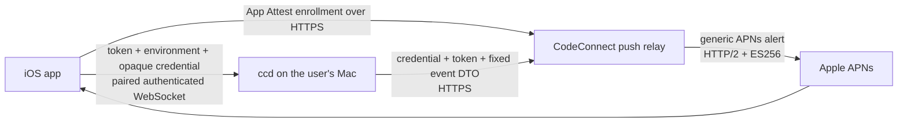

# CodeConnect Push Gateway: Architecture and Phased Implementation Plan

**Status:** Proposed  
**Baseline:** repository HEAD `c2ffdf2`  
**Target scale:** 1,000–10,000 users  
**Decision:** Add a small CodeConnect-operated push relay as the default customer path. Keep direct APNs delivery as an explicit developer override.

## 1. Verified baseline

The existing implementation is a strong single-Mac APNs sender, but it cannot serve App Store customers because the APNs provider key cannot be distributed to customer Macs.

Verified at the current repository HEAD:

- `mac/ccd/src/apns_sender.rs` is a complete raw HTTP/2 APNs sender. It creates ES256 provider tokens through `mac/ccd/src/apns_token.rs`, posts to `/3/device/{token}`, sets alert push type, priority 10, collapse IDs, and uses per-device serial queues.
- The provider JWT is cached for 40 minutes. Apple rejects provider tokens older than one hour.
- Each delivery currently opens a fresh TCP, TLS, and HTTP/2 connection.
- The sender has a 45-second local attempt deadline and 10-second connection/response bounds. The APNs `apns-expiration` header is one hour; the 45-second value is not the notification expiry.
- There is **no general retry/backoff**. Ordinary network, 429, and 5xx failures are logged and dropped. The only delivery retry is one `BadDeviceToken` attempt against the opposite APNs environment.
- APNs `410 Unregistered` conditionally clears the still-current token and retires its worker. Environment correction is also token-conditional.
- Queued ordinary doorbells coalesce to the newest notification per device. Tests do not coalesce and have a separate APNs collapse ID.
- `mac/ccd/src/apns.rs` exposes the correct abstraction already: `PushSender::send`, `send_test`, `retire`, and `is_live`.
- Startup selection in `apns_sender.rs` requires all four top-level `apns_*` settings. No settings, partial settings, or an unreadable key currently select `LoggingPushSender`.
- `hello_ack.capabilities.push` and `test_push` are derived from `is_live()` in `mac/ccd/src/ws_server.rs`. Today, “live” means structurally configured, not currently reachable; `test_push` is the actual delivery check.
- `RegisterPush` currently carries an APNs token and optional environment. Bootstrap-token connections are refused; registration requires a paired `device_id`.
- Token claiming, replacement, revocation filtering, late-410 protection, and environment correction are implemented atomically in `mac/ccd/src/store.rs` and `state.rs`.
- `mac/ccd/src/push_gate.rs` owns the per-device seen watermark, per-session ambient latch, prompt deduplication, and ticket invalidation.
- `Daemon::dispatch_push` waits 400 ms, revalidates the session/card/ticket, computes device exclusions and the blocked-run aggregate, and only then invokes the sender.
- There are four payload kinds—`approval`, `input`, `done`, and `idle`—but more than four call paths can produce them. The separate `PermissionRequest` path can also admit an approval.
- The current title is the selected project label when one is available, not simply “single blocked run”; it falls back to `CodeConnect` when no unambiguous label exists.
- `session_uid` is retained for local logging but is not serialized into APNs payloads.
- The current wire protocol is major 1, minor 13.

These properties should be preserved rather than reimplemented.

## 2. Target architecture



The trust boundary is intentionally narrow:

- The daemon remains the authority for sessions, triggers, eligibility, recipient exclusion, aggregation, and coalescing.
- The relay authenticates a token binding, applies abuse limits, constructs a generic payload, and transports it to APNs.
- The relay has no API or schema capable of receiving project names, session identifiers, commands, paths, diffs, or conversation content.

## 3. Architecture decisions

### Decision 1: App Attest is the launch authentication foundation

Use App Attest once per iOS installation to authorize issuance of an opaque relay credential. Use App Attest assertions only for sensitive lifecycle operations such as token rebinding, credential rotation, and revocation. Do not use assertions per push—the customer daemon cannot access the phone’s App Attest private key.

Apple describes App Attest as a hardware-backed key certified as belonging to a legitimate instance of the app, with server challenges and assertions for replay protection. App Attest keys survive app updates but not reinstall, device migration, or backup restoration. [Apple: establishing app integrity](https://developer.apple.com/documentation/devicecheck/establishing-your-app-s-integrity), [Apple: server-side validation](https://developer.apple.com/documentation/devicecheck/validating-apps-that-connect-to-your-server).

This is justified at launch because CodeConnect has no account system or other trusted credential issuer:

- Pure token rate limiting mitigates volume but does not authorize a sender. Anyone holding a stolen APNs token could use an unauthenticated relay.
- An HMAC secret embedded in the app or daemon is extractable and becomes a global relay credential.
- An HMAC generated only by the relay still requires a trusted issuance ceremony; App Attest supplies that ceremony.
- No authentication makes the service an open generic push endpoint.

App Attest is not a user identity and does not prove cryptographically that an APNs token originated on the same physical device. It proves that a legitimate app instance signed the token-binding request. A compromised genuine device remains a residual risk, contained by a fixed payload schema, token binding, and rate limits.

#### Enrollment and credentials

- The relay issues 32 random bytes encoded as base64url.
- The credential is a bearer secret bound to the normalized APNs token and environment.
- The relay persists only a cryptographic hash of the bearer and token, never their raw values.
- The raw token is supplied transiently on each push so the relay can verify its hash and address APNs.
- One credential represents the phone’s current `(token, environment)` tuple and may be shared with its paired Macs.
- A new credential for the same tuple atomically revokes the previous credential.
- A changed token requires an App Attest assertion and a replacement credential.
- A reinstall or missing App Attest key requires a new key and fresh attestation, even if an old Keychain credential survived.
- Active credentials do not expire on a short schedule. Silent expiry would make the first important notification after a long quiet period fail while the app is closed.
- Active bindings remain until assertion-authorized rotation/deletion, APNs `410`, replacement enrollment, or emergency generation invalidation.

Per-Mac credentials would make lost-Mac revocation more precise, but require a credential inventory, per-Mac identities at the relay, redistribution, and substantially more UI/state. At launch, a shared phone credential is the correct simplification. A security-sensitive lost-Mac action rotates the shared credential and requires the app to redistribute it to remaining Macs as they reconnect. Clearing one daemon’s local tuple is named “disable push on this Mac,” not “revoke credential.”

#### App Attest verification

Production verification must include:

- One-time 256-bit server challenge with a ten-minute maximum lifetime.
- Apple certificate-chain verification.
- Nonce and client-data hash verification.
- Expected App ID hash.
- Expected production/development AAGUID.
- Credential ID/key ID match.
- Initial counter and monotonic assertion-counter checks.
- Expected distribution validation category and bundle-version policy.
- Challenge consumption in the same transaction as enrollment.
- Separate development and production namespaces.

Use maintained CBOR, X.509, and signature libraries. Do not hand-roll general-purpose cryptography.

A development-only seed tool may bypass attestation for sandbox testing, but it must be local-only, absent from the production image, and impossible to enable through a production network request. An unsupported App Attest device can continue using the app but does not receive relay-backed push; there is no anonymous production fallback. Direct-key mode remains available.

#### Abuse limits

Initial server-side limits:

- Per token binding: burst 10, sustained 10/minute, 500/day.
- Test pushes count against the token budget and retain the daemon’s existing 30-second test floor.
- Challenge and enrollment endpoints receive separate IP and global limits.
- Invalid-auth traffic receives a stricter rotating-IP limit.
- Rate keys use the token binding, not the credential, so rotation cannot reset quotas.
- `429` includes `Retry-After`; neither daemon nor relay retries it automatically.

IP rate keys use a daily rotating server-side HMAC and expire within 24 hours. Raw IPs, authorization headers, tokens, and request bodies must not appear in application or reverse-proxy logs. Limits are operational settings on the service, not daemon configuration; increase them only after observing legitimate 429s.

### Decision 2: Generic-only relay payload

Choose option **(b)**. The relay accepts a closed event DTO and constructs the APNs document itself.

For ordinary relay notifications:

- Title is always `CodeConnect`.
- Body is one of:

  - `Waiting on an approval`
  - `Waiting for your input`
  - `Finished a turn`
  - `Waiting for you`
  - `{n} agents need you`

- Badge is the bounded blocked-run count.
- `interruption-level` remains `time-sensitive`.
- `codeconnect.kind` remains one of `approval`, `input`, `done`, or `idle`.
- Sound and fixed ordinary/test collapse IDs remain.
- Test notifications retain the existing fixed test copy and `codeconnect_test` marker.

The relay request cannot contain a title, body, prebuilt `aps` object, project label, session/device identifier, path, or arbitrary metadata. Unknown fields are rejected.

Direct-key mode may retain today’s project-labelled payload because it bypasses the relay and goes directly from the user’s Mac to Apple.

A Notification Service Extension is rejected. It cannot reliably reach the Mac while the phone is locked or the extension is under its execution deadline. Sending kind/count to let the extension rewrite locally provides no privacy gain over a generic relay-built alert, while a truly content-free notification would be uninformative. An NSE also adds another target, entitlement, signing path, and failure mode.

#### Privacy-page wording

The public statement should say:

> When relay-backed notifications are enabled, your daemon sends CodeConnect’s push relay only the APNs token and environment, an opaque token-bound credential, one of four fixed event kinds, a blocked-run count, a test marker when applicable, and ordinary network metadata. The relay never receives project names, session identifiers, commands, file paths, diffs, or conversation content; it builds a generic notification and forwards it to Apple.

The adjacent paragraph should disclose that enrollment sends an App Attest proof and that the relay retains the verified public key and receipt, assertion counter, token and credential hashes, status, and timestamps.

Retention policy:

- Consumed/expired challenges: at most 10 minutes.
- Raw APNs tokens and credentials at the relay: transient only, never database or logs.
- Active binding, App Attest public key/receipt, and counter: until explicit lifecycle termination.
- Revoked/terminal binding records: 30 days, then deleted.
- Redacted diagnostic logs: 7 days.
- Aggregate metrics without identifiers: 30 days.
- Rotating IP rate buckets: at most 24 hours.
- Encrypted backups: 30 days; deletion may therefore take up to 30 additional days to disappear from backups.

### Decision 3: Same-repo Rust relay on Render.com

Create two crates in the existing Rust workspace:

- `mac/push-core`: platform-neutral APNs authentication and protocol semantics.
- `mac/push-relay`: Linux relay service, App Attest verification, HTTP API, SQLite state, rate limits, and pooled APNs transport.

Keep the service in the same repository. A separate repository would introduce contract version skew and duplicated tests without creating a security boundary—the APNs key is protected by the deployment secret store, not by repository separation.

`push-core` should contain:

- APNs environments and hosts.
- `ApnsIdentity` and cached ES256 provider-token generation.
- Header and request construction.
- APNs reason-body parsing.
- Typed outcomes such as accepted, unregistered, bad device token, retryable refusal, and terminal rejection.

It must not depend on `ccd`, `protocol`, SQLite, the relay HTTP server, native trust-store policy, or a connection pool. Payload composers remain separate: project-labelled payloads in `ccd`, generic payloads in `push-relay`.

The current sender’s fresh-connection transport must not be copied into the centralized service. APNs supports concurrent HTTP/2 streams and reports connection termination using `GOAWAY`; the relay should use a maintained pooled HTTP/2 client and reconnect supervision rather than a hand-written pool. [Apple: APNs connections](https://developer.apple.com/documentation/usernotifications/establishing-a-connection-to-apns).

Start with one long-lived connection pool per APNs environment, bounded concurrent requests, and an in-memory per-token serialization lock. Serialization preserves arrival order across multiple Macs but does not coalesce or make delivery decisions.

Provision separate sandbox and production topic-specific keys for the CodeConnect app topic. Apple’s current key model supports environment-specific topic keys and a related key for rotation, reducing blast radius compared with a team-wide production key. [Apple: token-based APNs connections](https://developer.apple.com/documentation/usernotifications/establishing-a-token-based-connection-to-apns).

Deploy one service instance as a **Render.com web service** (an always-on paid instance — free instances sleep, which is disqualifying for a push path):

- Built from this repository via Render's native Rust or Docker build, deploys pinned to a git SHA, rollback to a pinned known-good SHA through the Render API or dashboard.
- SQLite WAL on a Render persistent disk. A disk binds the service to single-instance semantics and takes deploys through a brief restart instead of zero-downtime handover — both acceptable and already assumed by the single-instance design.
- TLS issuance/renewal, DNS for the `onrender.com` hostname, OS patching, process supervision, and automatic restart are managed by the platform.
- Backups are the database's own: a daily job inside the relay runs SQLite's online backup, encrypts the result, and uploads it to object storage with 30-day retention. Render's disk snapshots are supplemental at most — Render's own documentation warns against restoring snapshots of custom databases, and a snapshot restore destructively overwrites the disk — so a snapshot is never the restore path for the relay database.
- The APNs `.p8` keys and every other secret live in Render **secret files**, never in environment variables and never in the repository.
- External health monitoring against the service's health endpoint, plus Render's own health checks.
- Redacted structured metrics.
- Separate logical sandbox and production endpoints, keys, and data namespaces. They may share the initial instance.

A Render starter instance is currently about $7/month and a 1 GB persistent disk about $0.25/month; compute plus monitoring should remain approximately **$8–15/month**. [Render pricing](https://render.com/pricing).

Cloudflare Workers is technically plausible using `fetch` and WebCrypto, and its paid plan currently starts at $5 with 10 million requests included. However, its Node `http2` module is explicitly a non-functional stub, outbound connection lifecycle is abstracted, and adopting it would rewrite the existing Rust signing/request logic. [Workers pricing](https://developers.cloudflare.com/workers/platform/pricing/), [Workers Node compatibility](https://developers.cloudflare.com/workers/runtime-apis/nodejs/). Cold start is not the deciding issue under a 45-second envelope; controlled APNs connection reuse and code reuse are.

Managed push providers are also rejected for launch. They still require a trusted registration/authentication service, require handing another provider the APNs key and tokens, add SDK/data-processing surface, and discard much of the tested Rust implementation. They do not remove the core abuse-control problem.

### Decision 4: Three deterministic daemon modes

Add `push_enabled: bool`, defaulting to `true`. Do not add `push_mode`, `relay_url`, retry, quota, or fallback settings.

Selection order:

1. `push_enabled = false` → disabled/logging sender.
2. Any direct `apns_*` field present → require all four fields and a readable key.
   - Valid → direct APNs sender.
   - Partial or invalid → disabled/logging with an actionable error.
   - Never silently fall back to the vendor relay after an explicit direct configuration error.
3. No direct fields → relay sender using baked stable production/sandbox URLs.

Do not use the stale unused nested `config.apns` branch for new settings.

A relay outage at boot must **not** select the logging sender. That would permanently suppress registration until restart. Relay mode remains configured and advertised; ordinary sends fail within bounds, tests report the real failure, and recovery works without restarting `ccd`.

Replace the boolean-only `is_live` decision with an explicit internal mode:

```text
PushMode::Off
PushMode::Direct
PushMode::Relay
```

The existing trait can retain a configured predicate derived from the mode, but capability construction and registration validation must use the mode.

| Daemon mode | Legacy `push` | New `push_relay` | `test_push` |
|---|---:|---:|---:|
| Direct | true | false | true |
| Relay | false | true | true |
| Off | false | false | false |

Relay mode advertises legacy `push = false` intentionally. An old app would otherwise request permission and send a token without the required credential. The new app computes `PushMode` with direct precedence if both flags are ever observed.

`test_push` means the daemon has a configured delivery path. Its result remains the reachability check:

- Direct: `Accepted` only after APNs 2xx.
- Relay: `Accepted` only after the relay has received APNs 2xx.
- Off: `PushUnconfigured`.
- Missing tuple: `NoRegisteredToken`.
- Relay credential refusal: a new typed `credential_invalid` result.
- Relay 429: existing `rate_limited`.
- Network/APNs failure: `failed`.

#### Daemon storage and queueing

Add nullable `devices.push_credential`.

Registration must atomically handle the tuple:

```text
(push_token, push_environment, push_credential)
```

Requirements:

- Relay mode requires all three values.
- Direct mode accepts the legacy token/environment registration and does not persist a relay credential.
- Off mode refuses registration.
- Moving a token to another active device row moves or replaces its credential atomically.
- Token rotation cannot mix a new token with an old credential.
- Revocation clears the local tuple and retires the local queue.
- Late APNs 410 and environment correction compare the current token and credential before updating.
- Credential values use a redacted secret wrapper and never appear through `Debug` or logs.
- Validate even-length lowercase hex with a conservative size bound without hard-coding Apple’s current token byte length.

Extract the existing queue into a crate-private `ccd` component reused by direct and relay senders. Keep the latest-doorbell replacement, test queue bound, retirement, and serial execution exactly as they are.

#### Failure semantics

Correcting the brief: there is no retry/backoff to “carry over.”

Launch behavior remains best-effort:

- One daemon-to-relay attempt.
- Relay APNs work completes inside roughly 35–40 seconds; the daemon retains a 45-second outer bound.
- No durable spool.
- No retry after an ambiguous send or lost response.
- A transport may reconnect and retry only when it can prove the request body was not submitted.
- One explicit opposite-environment attempt remains for `BadDeviceToken`.
- APNs 410 invalidates the token binding.
- APNs 429/5xx and relay outages are logged/dropped for ordinary pushes and reported for tests.
- Credential 401/403 preserves the APNs token and triggers credential recovery; it is not misclassified as an unregistered phone.

### Decision 5: Precise registration and trust chain

The privacy-preserving flow intentionally begins only after pairing, rather than contacting the relay immediately at install:

1. App installs. No relay request and no notification prompt occur.
2. App pairs with a daemon and receives `hello_ack` containing a paired `device_id` and `push_relay = true`.
3. App requests notification permission.
4. APNs returns the token and environment.
5. App requests a one-time relay challenge.
6. App creates or loads its App Attest key and submits an attestation bound to the challenge and token tuple.
7. Relay verifies the attestation and atomically issues the opaque credential.
8. App stores the credential and App Attest key ID in ThisDeviceOnly Keychain storage.
9. App sends token, environment, and credential over the existing paired WebSocket.
10. Daemon stores the tuple atomically.
11. An unchanged daemon-side trigger passes through `PushGate`, the 400 ms grace, state revalidation, blocked aggregation, and recipient exclusion.
12. `RelayPushSender` constructs the fixed DTO and sends it to the relay.
13. Relay verifies credential/token binding, applies rate limits, constructs the generic APNs payload, waits for APNs, and returns a typed result.
14. APNs delivers to the phone. A tap follows the existing coarse `codeconnect.kind` routing and reconnects to the Mac for authoritative state.

On foreground activation, debounced to once per foreground session or at most daily, the app checks the cached credential:

- `active` → keep it.
- `reissue` → use an assertion to mint a replacement.
- `reenroll` → create a new App Attest key and attest again.
- `token_invalid` → discard the cached tuple and request APNs registration again.

The status bearer is read-only. It cannot rebind, revoke, reset generations, extend a credential lifetime, or mint a credential without App Attest.

#### Stored secrets and compromise impact

| Asset | Stored at | Compromise impact |
|---|---|---|
| App Attest private key | Apple-managed hardware-backed storage | Can authorize lifecycle operations for that installation if the phone is compromised; never exportable in the normal model. |
| App Attest key ID | iPhone Keychain; relay metadata | Not secret by itself. Loss on the phone requires fresh enrollment. |
| Relay bearer credential | iPhone ThisDeviceOnly Keychain and paired daemon SQLite | With the matching token, permits only fixed generic notifications to that phone within limits. Rotation invalidates every Mac holding the shared credential. |
| APNs token/environment | iPhone/APNs and daemon SQLite; transient at relay | Routing identifier, not provider authority. Token alone cannot use the relay. |
| Credential/token hashes | Relay SQLite and encrypted backups | Database-only compromise does not reveal the high-entropy bearer or token needed to push. |
| App Attest public key, receipt, counter, status, timestamps | Relay SQLite | Reveals installation/security metadata but cannot create assertions. |
| Topic-specific APNs `.p8` key | Relay secret mount only | Runtime compromise can send notifications for that app topic/environment. It cannot retrieve conversation content. |
| Pairing credential | Existing phone Keychain and daemon pairing store | Existing, broader risk: compromise may permit access to the daemon’s session API. It is never sent to the relay. |
| Bootstrap credential | Existing Mac configuration | Cannot register push because `RegisterPush` remains paired-device-only. |
| Relay TLS key | TLS terminator/secret store | Could permit service impersonation if the surrounding host/DNS boundary is also compromised. |
| Relay runtime | Memory while requests are active | Can observe raw tokens, credentials, kind/count, timing, and source IP in flight and can abuse the APNs topic key. It cannot expose project or conversation content because none is transmitted or stored. |

A relay runtime compromise can generate malicious notification text with the stolen APNs key; no server design can prevent that after key compromise. The important containment is that the relay has no conversation or project data to leak and the APNs key is scoped to one topic and environment.

### Decision 6: Gate and product semantics do not move

The following remain daemon-side and unchanged:

- Trigger mapping and the four `PushKind` values.
- `PushGate` ambient latch.
- Per-device delivered/seen watermarks.
- Permission-prompt twin deduplication.
- Session/ticket/card revalidation.
- The 400 ms dispatch grace.
- Blocked-run aggregation.
- Per-device recipient exclusion.
- Per-device queue ordering and latest-doorbell replacement.
- Test queue handling.
- Session/device eviction.
- The event log as authoritative state.
- Notification tap routing.
- The direct APNs-key path.

The fixed APNs collapse header is mechanically applied by the relay because the relay becomes the APNs caller. That is not a migration of business coalescing. The relay’s per-token in-flight lock is transport ordering only; it never decides which event is current or drops one in favor of another.

## 4. Relay protocol

Use a versioned HTTPS API. The push endpoint carries the bearer in `Authorization`, never in the URL or JSON.

Ordinary request:

```json
{
  "schema": 1,
  "token": "<lowercase APNs token>",
  "environment": "production",
  "notification": {
    "type": "doorbell",
    "kind": "approval",
    "blocked_count": 1
  }
}
```

Test request:

```json
{
  "schema": 1,
  "token": "<lowercase APNs token>",
  "environment": "production",
  "notification": {
    "type": "test"
  }
}
```

Rules:

- Strict tagged enum and `deny_unknown_fields`.
- Small request/body/header limits.
- Bounded blocked count.
- No arbitrary strings except the token and credential.
- No daemon device ID.
- No `PushHint` serialization.
- Relay answers only after APNs answers.
- Accepted response includes optional `apns_id` and the accepted environment.
- Typed outcomes include `accepted`, `unregistered`, `credential_invalid`, `rate_limited`, `rejected`, and `unavailable`.
- An accepted opposite-environment attempt atomically corrects the relay binding and returns that environment for daemon CAS persistence.
- **The relay binding is the single authority for a token's APNs environment, and the environment in a push request is advisory.** The relay addresses APNs by the binding's environment regardless of the advisory value and returns the authoritative environment in every accepted response — a delivery is never refused for a stale advisory environment, which is what lets a second Mac that has not yet learned a correction still deliver, be corrected by the response, and CAS-persist the truth. The app's registration environment is a hint used only when a binding does not yet exist. Today the app resends its cached environment on every handshake (`AppModel.swift:298`); Phase 3 replaces that with persistence of `hello_ack.push_environment` (section 5) into the Keychain tuple, and the correction must be proven to survive a reconnect and a push from a second Mac.

## 5. CodeConnect protocol impact

Increment `PROTOCOL_MINOR` from 13 to **14**. Protocol major remains 1.

Add:

- `Capabilities.push_relay: bool`, default false.
- `RegisterPush.relay_credential: Option<String>`, default absent.
- `TestPushResult.credential_invalid`.
- `hello_ack.push_environment: Option<String>` — the daemon's current authoritative APNs environment for this device's registered token, absent when no token is registered. The app compares it to its cached tuple on every handshake and persists a difference into the Keychain instead of resending the stale value; this is the concrete daemon→app propagation path for relay-side corrections.

Do not add a client-minor field to `hello` and do not add `RegisterPushResult`. Registration remains idempotent, server errors remain visible, and `test_push` is the meaningful end-to-end proof. An acknowledgement would prove only a database write.

Compatibility matrix:

| App | Daemon | Result |
|---|---|---|
| New | Old direct-key daemon | Sees `push=true`; performs legacy token-only registration. |
| New | Old unconfigured daemon | No prompt or relay contact. |
| Old | New direct-key daemon | Existing direct flow continues. |
| Old | New relay daemon | Sees legacy `push=false`; does not enter a broken credential-less flow. |
| New | New relay daemon | Sees `push_relay=true`; enrolls and sends the tuple. |
| Any | Bootstrap/static connection | No `device_id`; registration remains forbidden. |

In Swift, define `PushMode { none, direct, relay }`:

- `push == true` takes direct precedence.
- Otherwise `push_relay == true` selects relay.
- Otherwise none.

Capture and recheck that mode with the connection generation. Update registration gating, test-button gating, and capability display to use the normalized mode rather than raw `capabilities.push`.

## 6. Phased implementation plan

No phase starts until the preceding acceptance gate passes.

### Phase 0 — Decision record, threat model, and privacy truth

#### Scope

- Add this plan as `docs/push-gateway.md`.
- Update `site/privacy.md` immediately.
- Audit `site/support.md`, `mac/README.md`, `ios/README.md`, and other public pages for categorical “operates no servers,” “direct to Apple,” “we never see it,” or “no endpoints” claims.
- Record the relay data inventory, retention schedule, credential lifecycle, rate limits, and threat model.
- Record that direct-key mode and relay mode have different payload/privacy properties.
- Reassess `ios/CodeConnect/PrivacyInfo.xcprivacy` and App Store privacy answers before the app release.

#### Built

- An agreed architecture and explicit privacy contract.
- Public wording that is already true as a conditional description before relay traffic begins.
- A production-data prohibition until this phase lands.

#### Deliberately not built

- Relay service.
- Daemon or app protocol changes.
- Production endpoint or APNs key deployment.

#### Acceptance gate

- Repository search finds no unqualified claim that CodeConnect operates no servers or that every notification goes directly from Mac to Apple.
- Public preview distinguishes direct and relay-backed notifications.
- The plan contains every transmitted and retained field with retention periods.
- The threat model explicitly covers stolen token, stolen bearer, daemon compromise, relay database compromise, relay runtime compromise, APNs-key compromise, reinstall, and lost Mac.
- No production relay traffic exists.

### Phase 1 — Relay service independently testable against APNs sandbox

#### Scope

- Add `mac/push-core`.
- Add `mac/push-relay`.
- Add `ops/push-relay` deployment assets.
- Update `mac/Cargo.toml` and the shared lockfile.
- Add `mac/push-core` to `mac/protocol/build.rs` shipped-source identity paths because `ccd` will depend on it.
- Add a separate Linux relay build/deploy workflow pinned to a commit SHA.
- Keep existing Mac packaging lists unchanged so the relay is not placed in Mac release archives.

#### Built

- Extracted APNs JWT, request/header, environment, and status-classification code.
- Generic relay payload composer with golden fixtures.
- App Attest challenge, enrollment, assertion, status, rotation, and deletion endpoints.
- SQLite schema for attested installations, bindings, challenges, counters, tombstones, and rate buckets.
- Credential/token hashing and secret-redaction types.
- Persistent library-managed HTTP/2 APNs client.
- Separate sandbox and production keys/namespaces.
- Per-token in-flight serialization.
- Fixed DTO validation and abuse limits.
- `send_enabled`, `enrollment_enabled`, and minimum-credential-generation operational kill switches.
- Liveness/readiness endpoints and redacted metrics, including deployed git SHA.
- Local-only `relayctl seed-sandbox-binding` for a development phone.

Linux CI is scoped rather than running the Mac-specific workspace indiscriminately:

```text
cargo clippy -p push-core -p push-relay --all-targets -- -D warnings
cargo test -p push-core -p push-relay --locked
cargo build -p push-relay --release --locked
```

The container build context is `mac/` so workspace manifests and path dependencies are available. Use a Debian-slim class image with CA certificates rather than an image lacking a trust store. Relay dependencies must remain compatible with the workspace MSRV.

#### Deliberately not built

- Daemon relay sender.
- iOS App Attest UI/flow.
- Production notification rollout.
- Durable queues.
- Multi-region deployment, load balancer, Redis, PostgreSQL, Kubernetes, or an administrative web dashboard.
- Network-accessible auth bypass.

#### Acceptance gate

- Golden tests cover every kind, blocked-count branch, test payload, collapse ID, and 4 KB bound.
- Requests containing title, body, `aps`, project/session/path/identifier fields, oversized values, or unknown fields are rejected.
- Attestation fixtures prove certificate, nonce, App ID, AAGUID, key ID, counter, validation category, bundle version, tamper, and challenge-replay handling.
- Credential and token mismatches fail. A stale advisory environment does not: the relay delivers on the binding's environment and returns the authoritative value (section 4).
- Database inspection finds no raw APNs tokens or bearer credentials.
- Logs contain no authorization headers, raw tokens, bearer values, attestation objects, or raw IPs.
- Rate limits return 429 with `Retry-After`; rotation cannot reset the token budget.
- Two pushes reuse the APNs connection; simulated `GOAWAY` reconnects for subsequent traffic without replaying an ambiguous request.
- APNs 410, 400 `BadDeviceToken`, 403, 429, and 5xx map to the documented typed outcomes.
- The send kill switch proves no APNs request is emitted.
- Backup restoration succeeds in a clean service instance.
- Using the local sandbox seed tool and an unchanged development app, a physical phone receives a generic `CodeConnect` test notification and the tool reports APNs acceptance.
- No production key is present in ordinary CI.

### Phase 2 — Daemon integration and protocol minor 14

#### Scope

- Add `mac/ccd/src/relay_sender.rs`.
- Extract the reusable daemon queue into a crate-private push queue component.
- Move selection into a transport-neutral push builder.
- Add `PushMode`.
- Add `push_enabled`.
- Add protocol minor 14 fields and tests.
- Add the `devices.push_credential` migration and atomic store operations.
- Update `ws_server.rs`, `state.rs`, `apns.rs`, APNs sender integration, config comments, and known-limit documentation.

#### Built

- Default relay sender when direct fields are absent.
- Direct-key override and explicit-off behavior.
- Mode-specific `RegisterPush` validation.
- Fixed relay DTO construction after local recipient exclusion.
- Typed relay outcomes and CAS token/environment/credential updates.
- Credential-invalid and relay-rate-limit test handling.
- Test-only injected relay URL/client for deterministic tests; no public relay URL configuration.
- Shared queue semantics across direct and relay transports.

#### Deliberately not built

- App Attest enrollment in the iOS app.
- Boot-time relay probe.
- Automatic relay-to-direct or direct-to-relay fallback.
- Retry queue, idempotency service, or offline spool.
- Changes to `PushGate`, triggers, aggregation, or seen filtering.
- Cleanup of the stale nested `config.apns` branch unless performed as a separate deliberate migration.

#### Acceptance gate

- Selection matrix passes:

  - `push_enabled=false` → off.
  - Zero direct fields → relay.
  - Four valid direct fields → direct.
  - Partial or invalid direct fields → off with error.
  - Relay client construction without network access → configured relay mode.

- Capability matrix is one-hot and matches the table above.
- Relay outage at boot leaves relay capability configured; `test_push` fails honestly.
- Restoring the relay makes a later test work without restarting the daemon.
- Old/new wire fixtures prove unknown optional credential fields are ignored by an old daemon and legacy direct registration is accepted by a new daemon.
- Relay mode refuses a credential-less registration; direct mode accepts it.
- Token and credential rotation is atomic; duplicate token ownership cannot mix credentials.
- Revoked rows never target.
- Late 410 or environment correction cannot alter a replacement tuple.
- Exact DTO tests across all four kinds prove project label, session UID, device ID, exclusions, paths, and arbitrary copy are absent.
- Relay `Accepted` is not returned until the mock downstream APNs response arrives.
- Queue ordering, latest-doorbell replacement, test queue bound, and retirement tests run against both direct and relay attempt closures.
- Existing `push_gate`, state, 400 ms grace, trigger, aggregation, and seen-filter tests remain unchanged and green.
- A manually seeded credential provides daemon → relay → sandbox APNs delivery without the new app.

### Phase 3 — iOS App Attest and credential flow

#### Scope

- Extend `ios/CodeConnect/Protocol/WireTypes.swift`.
- Keep APNs permission/token responsibilities in `PushRegistration.swift`.
- Add a separate relay-enrollment actor/client.
- Update `AppModel.swift` orchestration.
- Update push/test UI and capability presentation in `FleetView.swift`.
- Add App Attest entitlements and production/development environment handling.
- Add ThisDeviceOnly Keychain storage for the key ID and credential tuple.
- Reassess `PrivacyInfo.xcprivacy` and App Store privacy declarations.

#### Built

- `PushMode` normalization with direct precedence.
- Lazy enrollment only after a paired relay-capable handshake and APNs token.
- Single-flight enrollment keyed by `(token hash, environment)`.
- Connection-generation and token-tuple rechecks before registration is sent.
- Direct mode that never contacts the relay.
- Foreground status/recovery checks with debounce and backoff.
- Token change assertion/rebinding.
- Fresh enrollment after reinstall, lost key ID/private key, or relay database recovery.
- Local states such as `enrolling`, `ready`, and `failed`, incorporated into the existing test-button explanation.
- A “reset notification registration” action.
- Shared-credential rotation for a lost-Mac incident and redistribution on subsequent authenticated Mac connections.
- Foreground re-read of notification authorization. If permission was enabled in Settings during the same launch and no token is cached, call `registerForRemoteNotifications` without prompting again.
- Clear unsupported-device messaging with no insecure fallback.

#### Deliberately not built

- Notification Service Extension.
- Accounts, OAuth, refresh-token families, or per-push App Attest.
- Per-Mac relay credentials.
- Certificate pinning or daemon mTLS.
- Background polling of the relay.
- A registration acknowledgement message.

#### Acceptance gate

- Unit tests cover attestation, assertion, challenge replay, counter changes, token binding, status recovery, and Keychain loss.
- A late enrollment result for an old APNs token cannot replace or register over the current token.
- Switching relay → direct during enrollment sends the token directly and suppresses the stale relay result.
- Switching direct → relay starts enrollment from the cached APNs token.
- All raw `capabilities.push` UI and flow checks use normalized `PushMode`.
- The compatibility matrix in section 5 passes.
- Static/bootstrap connections never prompt or enroll.
- Direct mode generates no relay network request.
- Unsupported App Attest devices retain all non-relay app functionality.
- Deny-in-app, enable-in-Settings, foreground, and register flow works in one launch.
- `PrivacyInfo.xcprivacy` declares the relay enrollment data under App Store collection definitions (the record is transmitted off-device to a developer-operated service), and the declaration matches the privacy policy exactly.
- Physical development-device sandbox App Attest and APNs delivery passes.
- TestFlight production App Attest and production APNs delivery passes.
- Token rotation, reinstall, missing App Attest key, relay credential invalidation, relay outage, and multiple paired Macs are exercised.
- An environment correction survives an app reconnect and a push from a second paired Mac — the app persists the corrected tuple rather than resending its cached one.
- Notification test results and tap routing remain correct.

### Phase 4 — Documentation, rollout, and operational readiness

#### Scope

- Finalize `site/privacy.md`, support material, App Store privacy answers, release notes, and architectural diagrams.
- Update Mac and iOS READMEs and protocol comments.
- Add the operational runbook below.
- Deploy the relay and perform staged rollout.

#### Rollout order

1. Land corrected privacy disclosures.
2. Deploy the relay dark with enrollment and send kill switches available.
3. Complete sandbox and TestFlight soak.
4. Publish the iOS app with App Attest and minor-14 understanding first.
5. Confirm the app release and relay backend form a complete path.
6. Release the minor-14 daemon with default relay mode.
7. Enable production sends and watch acceptance, rejection, auth, rate-limit, and latency metrics.
8. Keep direct-key override operational throughout.

#### Deliberately not built

- Multi-region active/active.
- Guaranteed delivery or message replay.
- Durable notification history.
- User accounts.
- Self-service relay URL/provider selection.
- A managed push-provider fallback.

#### Acceptance gate

- Public docs contain no contradiction about server operation, payload content, or retained data.
- App Store disclosures match observed network/storage behavior.
- Production test push returns an APNs ID and displays on a physical App Store/TestFlight device.
- A seven-day limited soak has no unresolved APNs-auth, credential, privacy-log, or service-restart failures.
- APNs key rotation, credential generation reset, send kill switch, enrollment kill switch, relay outage, database restore, TLS renewal, and rollback drills pass.
- Alerts exist for APNs 403, elevated 5xx, elevated credential failures, sustained 429s, pool reconnect storms, disk pressure, failed backups, and certificate expiry.
- A log sample and restored backup are inspected for raw token/credential leakage.
- Direct-key delivery remains functional with the relay fully disabled.

## 7. Operational runbook

### APNs-key rotation

1. Create the related topic-specific replacement key in the affected environment.
2. Mount both old and new keys.
3. Switch new JWT generation to the replacement.
4. Verify a protected physical-device smoke test.
5. Drain and close existing APNs connections.
6. Revoke and remove the old key.
7. Re-establish connections and monitor `InvalidProviderToken`/403 responses.

Sandbox and production rotate independently.

### Relay outage

- Disable no local state and enqueue no replay.
- Ordinary pushes fail and are dropped; the Mac event log remains authoritative.
- `test_push` reports failure.
- Capabilities remain configured.
- Restore or roll back the relay; daemons recover without restart.
- Direct-key users are unaffected.
- For a prolonged outage, publish status rather than enabling unauthenticated fallback.

### App Attest outage

- Existing credentials and pushes continue.
- Pause new enrollment/rotation if verification is unreliable.
- Apps retry later using bounded foreground backoff.
- Never bypass App Attest in production.

### Credential incident or lost Mac

- “Disable push on this Mac” clears only that daemon’s tuple.
- A lost or compromised Mac requires assertion-authorized rotation of the shared phone credential.
- Revoke the old bearer atomically.
- Send the replacement to the currently connected Mac and remaining Macs as they reconnect.
- For broad compromise, raise the minimum credential generation and let foreground status drive assertion-based reissue.
- If the relay no longer knows the App Attest key, require fresh attestation.

### APNs `410 Unregistered`

- Mark the binding terminal.
- Return `unregistered` to the daemon.
- CAS-clear the still-current daemon tuple.
- Foreground status returns `token_invalid`; the app asks APNs to register again.
- Do not reissue a credential for the same terminal token.

### Abuse event

- Inspect aggregate token-binding, invalid-auth, and IP-bucket metrics without exposing raw identifiers.
- Lower per-binding or global caps if necessary.
- Disable one binding or all sends without disabling enrollment.
- Preserve evidence only under the documented retention policy.
- Do not add arbitrary payload inspection because arbitrary payloads are impossible by schema.

### Database loss or restore

**A restore fails closed: it must never resurrect authority that was revoked after the snapshot.**

- Restore the latest encrypted SQLite online backup — never a platform disk snapshot of the database.
- Bump the **generation floor** — a monotonic integer stored outside the database, in a Render secret file. Every bearer credential records the generation it was minted under, and the relay refuses any bearer below the floor. Bumping it invalidates every restored bearer at once, so a credential revoked after the snapshot cannot come back to life; every phone re-enrolls through App Attest on next contact via `reenroll`.
- Expire all restored replay state: outstanding challenges are dropped, and assertion counters are treated as untrusted until the next successful assertion re-establishes them.
- The app generates a new App Attest key and performs fresh attestation; it does not attempt to re-attest a lost server record with an unavailable attestation object.
- Confirm permissions, ownership, migrations, key loading, and a sandbox smoke test before reopening production sends.
- **Restore drill, tested before launch and after any schema change:** revoke a credential, take a backup from *before* the revocation, restore it, and prove the revoked credential is refused.

### TLS, host, and release maintenance

- TLS, DNS, host-OS patching, and process supervision are Render-managed; what remains to monitor is disk, memory, SQLite checkpoint health, backup recency, and the deployed git SHA.
- Patch relay dependencies **and the Docker base image** on a defined monthly cadence, accelerating for security releases — Render manages the host, not the container's packages.
- Deploy relay revisions independently from Mac/App Store releases, via the Render API or dashboard, with **auto-deploy explicitly disabled on the service** — otherwise a later branch push silently replaces a pinned release.
- Roll back to a pinned known-good SHA; never roll back the database without following the restore procedure.
- The Render account API key is a deployment credential: it lives outside the repository, is rotated after initial setup and after any suspected exposure, and is never required by the running relay.

## 8. Cost and scale estimate

Assuming 20 notifications per active user per day:

| Active users | Pushes/month | Average relay rate |
|---:|---:|---:|
| 1,000 | ~600,000 | ~0.23 requests/sec |
| 10,000 | ~6,000,000 | ~2.3 requests/sec |

Bursts matter more than averages, but this remains comfortably within one small Rust service, SQLite WAL, and one APNs connection pool per environment.

Expected launch cost:

- Render starter instance: approximately $7/month; persistent disk: approximately $0.25/month.
- External monitoring: $0–8/month.
- Total: approximately **$8–15/month**.

Scale out only after measurements show sustained connection saturation, SQLite contention, unacceptable latency, or an availability requirement that justifies a second instance. None of those should be designed pre-emptively for 1–10k users.

## 9. Explicit launch non-goals

The launch implementation will not include:

- Kubernetes, Redis, Kafka, PostgreSQL, or multi-region HA.
- Durable queues or stale-notification replay.
- A JavaScript/Workers rewrite of tested Rust APNs logic.
- A managed push provider.
- Per-push App Attest.
- Per-Mac relay credentials.
- Accounts or an identity service.
- Notification Service Extension.
- Arbitrary notification content.
- Public relay URL configuration.
- Certificate pinning or customer-daemon mTLS.
- Silent direct/relay fallback.
- Short periodic credential expiry.
- Boot-time reachability-based capability changes.

These features add operational or lifecycle complexity without closing a launch-scale correctness or security gap.
